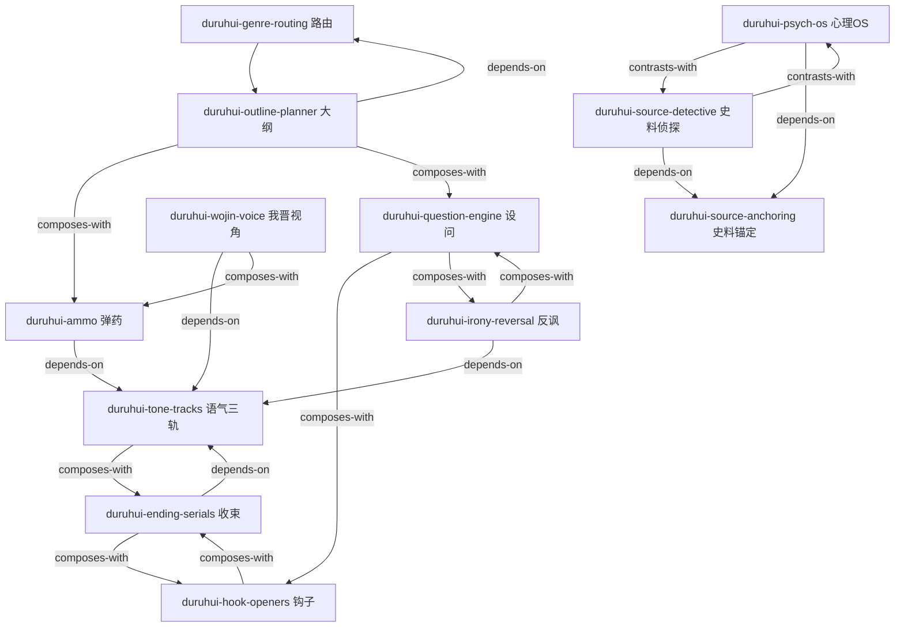

# 杜茹慧历史文风 · Skill 仓库索引

> 蒸馏自 B 站历史 UP 主「杜茹慧」两晋系列 45 篇视频文案（331,313 字）。
> 核心能力：**给定任何朝代的历史人物/事件/朝代文素材，改写成杜茹慧风格的视频口播文案。**
> 生成方式：仓颉 RIA-TV++ 流水线（阶段0整书理解 → 阶段1五路提取 → 阶段1.5三重验证 → 阶段2 RIA++构造 → 阶段3互链 → 阶段4压力测试 → 阶段5交付）。

## 使用方式

**写作一篇杜茹慧风格文案的标准调用链（按序加载）：**

1. `duruhui-genre-routing` —— 判断文章大类（人物/事件/朝代），选择叙事路由
2. `02-大纲规划-duruhui-outline-planner` —— 生成大纲：事件顺序 + 弹药布点
3. `duruhui-wojin-voice` —— 确立「我晋」领属视角与称呼系统
4. `duruhui-hook-openers` —— 写开头钩子
5. `duruhui-question-engine` —— 用设问驱动叙事推进
6. `duruhui-psych-os` —— 给历史人物写心理 OS（内心独白）
7. `duruhui-ammo` —— 部署弹药（现代词汇降维）
8. `duruhui-irony-reversal` —— 预期违背式反讽收束段落
9. `duruhui-source-anchoring` —— 全程史料锚定（年号双标、原文+翻译）
10. `duruhui-source-detective` —— 脑补处挂「我们有理由相信」声明牌
11. `duruhui-tone-tracks` —— 戏谑/悲悯/热血三轨换挡
12. `duruhui-ending-serials` —— 收尾：金句 + 栏目 + 下期预告 + over 拜拜

## Skill 清单

### 路由与规划层

| Skill | 一句话职责 |
|---|---|
| `duruhui-genre-routing` | 人物/事件/朝代三分路由，决定叙事主线与笔墨配比 |
| `duruhui-outline-planner` | 大纲先行：事件编年顺序 + 弹药布点表，动笔前必做 |

### 视角与语气层

| Skill | 一句话职责 |
|---|---|
| `duruhui-wojin-voice` | 「我晋」领属视角 + 判词式绰号系统（影帝/屠伯/飞豹/二凤） |
| `duruhui-tone-tracks` | 戏谑/悲悯/热血三条语气轨道的识别与换挡 |

### 叙事引擎层

| Skill | 一句话职责 |
|---|---|
| `duruhui-hook-openers` | 开头钩子四式：悬念/反差/判词/代入 |
| `duruhui-question-engine` | 设问驱动引擎：用问题链推动叙事、立靶子 |
| `duruhui-psych-os` | 心理 OS 代入：给人物写现代语感内心独白 |
| `duruhui-irony-reversal` | 预期违背反讽：先铺垫崇高/紧张，再一句戳破 |
| `duruhui-ending-serials` | 连续剧收束：金句 + 上期回顾/下期预告 + 固定道别 |

### 弹药与考据层

| Skill | 一句话职责 |
|---|---|
| `duruhui-ammo` | 弹药部署：现代词汇降维（错位感×精确性），含分类弹药库 |
| `duruhui-source-anchoring` | 史料锚定：年号+公元双标、原文+白话翻译、注明出处 |
| `duruhui-source-detective` | 史料侦探推理：脑补/推断必须挂声明牌，戏谑止步于史实 |

## 关系图



## 推荐学习/加载顺序

**新手（第一次用这套仓库写文）：** 按上方「标准调用链」1→12 顺序即可。

**进阶（只需某个单点能力）：**
- 只想要「杜茹慧味儿」的语感 → `duruhui-wojin-voice` + `duruhui-tone-tracks`
- 只想学弹药 → `duruhui-ammo`（内含分类弹药库与部署规则）
- 只想保证不翻车（史实红线） → `duruhui-source-anchoring` + `duruhui-source-detective`

## 文件结构

```
books/duruhui-liangjin/
├── INDEX.md            ← 本文件
├── GLOSSARY.md         ← 术语词典 + 分类弹药库
├── BOOK_OVERVIEW.md    ← 阶段0：整书理解（45篇分类+16技法+批判）
├── digest.md           ← 机械提取层（199KB 原文证据）
├── PIPELINE_STATE.md   ← 流水线状态与用户决策日志
├── candidates/         ← 阶段1：五路提取候选
├── verified.md         ← 阶段1.5：三重验证通过记录
├── rejected/           ← 降级/淘汰的候选（含原因）
├── DIGEST.md           ← 阶段5：精华长文
├── test-prompts.json   ← 阶段4：压力测试集
└── duruhui-*/SKILL.md  ← 12 个 skill
```
